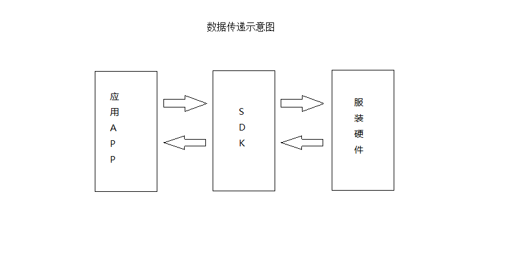
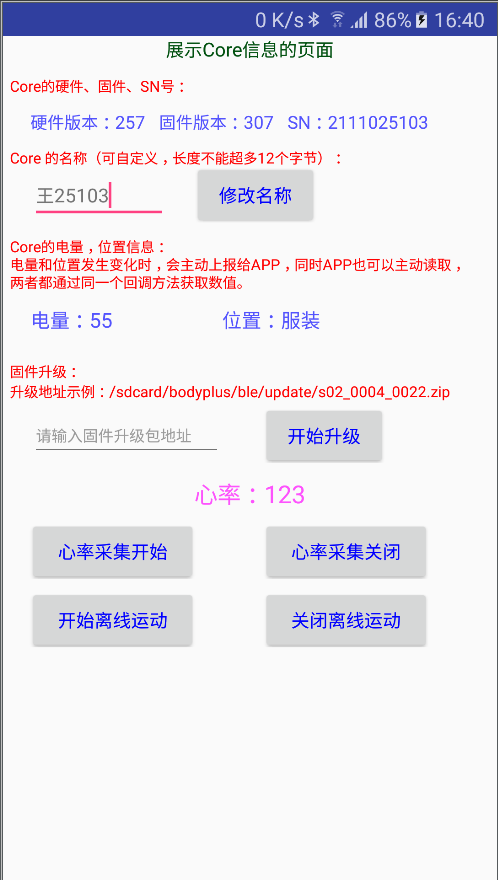

# BPBLESDK-S02-Adnroid
 Android BLE-SDK for BodyPlus's Aerobic Core.
 
 ## How to use 
#### Step 1. Add the JitPack repository to your build file

```
allprojects {
		repositories {
			...
			maven { url 'https://jitpack.io' }
		}
	}
```

#### Step 2. Add the dependency
[](https://jitpack.io/#BodyPlusTechnology/BPBLESDK-S02-Adnroid)
~~~
	dependencies {
	        implementation 'com.github.BodyPlusTechnology:BPBLESDK-S02-Adnroid:v1.0'
	}
~~~

 ### 1、概述
本文档是集BodyPlus Android版SDK的用户指南，介绍了使用蓝牙4.0技术连接BodyPlus 
Core的基本使用。关于各类的函数和参数更详细的说明，请参考下文说明；在集成过程有疑问，联系BodyPlus官方。
安卓 BosyPlus SDK 的功能从调用开始到结果返回，大多使用接口（Interface）回调（Callback）的方式返回结果和状态。更多关于接口和回调的介绍，可以参考 Java 语言的相关语法说明文档。

注意：
此文章的代码，仅为用于示例函数调用和参数设置的代码片段，很可能有参数被引用，却未曾声明等情况，请开发者不必过于考究其中的细节。更详细的示例，请参考 SDK 包中的示例工程。

BodyPlus SDK 作为硬件和上层APP数据传输的桥梁，如下图所示：


### 2、准备工作
#### 2.1 引入SDK
使用Android studio开发工具,导入BodyPlus的SDK至Android工程的libs目录下,并在build.gradle文件中增加依赖：compile &apos;no.nordicsemi.android:dfu:1.2.0&apos;。详情可以参见示例程序。


#### 2.2 添加用户权限

在工程AndroidManifest.xml 文件中添加如下权限（以示例demo为准）：
&lt;!--蓝牙搜索及文件操作权限 --&gt;
&lt;uses-permission android:name=&quot;android.permission.WRITE_EXTERNAL_STORAGE&quot; /&gt;
&lt;uses-permission android:name=&quot;android.permission.READ_EXTERNAL_STORAGE&quot; /&gt;
&lt;uses-permission android:name=&quot;android.permission.ACCESS_COARSE_LOCATION&quot; /&gt;
&lt;uses-permission android:name=&quot;android.permission.BLUETOOTH&quot; /&gt;
&lt;uses-permission android:name=&quot;android.permission.BLUETOOTH_ADMIN&quot; /&gt;
&lt;uses-permission android:name=&quot;android.permission.CAMERA&quot; /&gt;
&lt;uses-permission android:name=&quot;android.permission.RECORD_AUDIO&quot; /&gt;
&lt;!--增加对硬件不支持BLE的过滤（Android系统4.3以上）--&gt;
&lt;uses-feature
&nbsp;&nbsp;&nbsp;&nbsp;&nbsp;&nbsp;&nbsp; android:name=&quot;android.hardware.bluetooth_le&quot;
&nbsp;&nbsp;&nbsp;&nbsp;&nbsp;&nbsp;&nbsp; android:required=&quot;true&quot; /&gt;

#### 2.3初始化

初始化即创建Ble管理对象，只有初始化后才可以使用BodyPlus的各项服务。建议将初始化放在程序入口（如Application的onCreate方法，如果是在后台启动，请注意Android O的限制），初始化代码如下：
/**
&nbsp;* 初始化程序蓝牙管理类
&nbsp;*/
BleConnectionManger.getInstance().init(context，@Nullable dfuListener);
初始化后，即可在程序的同一进程中的其他组件中使用该管理类。


### 3、工程开始


#### 3.1 名词解释


| 名词 | 解释 |
| --- | --- |
| 搜索| 使用手机蓝牙搜索周边的蓝牙设备 |
| 绑定 |  将某个设备和用户关联起来。如张三用户和XX设备绑定，那么张三再切换登录时，仍可以根据已绑定信息来重新连接设备。 |
| 连接 | 手机通过蓝牙和设备建立通讯关系 |
| 断开连接 | 上述通讯关系断开（可以主动断开连接，也可能由于距离等情况断开连接） |
| 重连| 重新建立通讯关系|
|SN号 | 设备出厂编号| 
|硬件版本 |设备出厂时硬件的版本（不可修改和升级） |
|固件版本 |  硬件的程序版本（可升级）|
|固件升级 |通过官方的升级渠道来升级固件中的程序 |

#### 3.2语法识别


程序中所有数据交互均由通讯核心类BleConnectionManger及接口BleConnectionInterface来完成，方法如下


##### BleConnectionManger 中的方法说明 （持续更新中）

// 获取通讯管理类的实例
public static BleConnectionManger getInstance();

// 添加BleConnectionInterface 接口的实例对象到通讯管理类中，用于获取返回信息（可以//有多个BleConnectionInterface 实例对象同时接受数据。）。
//布尔类型的isRegisterBodyData状态，表示是否接收心率数据（同一时刻只有一个//BleConnectionInterface 对象可以接受心率数据）
Public synchronized void addConnectionListener
(BleConnectionInterface bleConnectionInterface,boolean isRegisterBodyData) ;

// 退出时清除所有ble相关的信息
public void clearAll();

//移除数据接收对象
public synchronized void removeConnectionListener(
BleConnectionInterface bleConnectionInterface)

//搜索设备
public void searchDevice()

//绑定设备
public void connectDevice(MyBleDevice deviceInfo)

//断开设备连接
public void disconnect()

//读取设备电池电量
public void fetchPowerLevel()

//读取设备的位置信息
public void fetchCoreMode()

//DFU升级 参数：上下文、 升级压缩包路径、 设备当前固件版本号、升级监听
public int startDfu(Context context, String path, String oldVersion, 
DfuProgressListener mDfuProgressListener) 

//开启、关闭某一个设备的数据ECG采集
public void switchEcgChannel(boolean isSwitch) 

//更改设备名称
&nbsp;public void changeBleName(String name)

&nbsp;
//根据SN号自动重连
public void autoConnectBle(String sn)

BleConnectionInterface接口中方法说明

//分发事件 搜索，绑定的返回（实例程序中有使用）
void bleDispatchMessage(Message msg);

//回调Body数据 肌电 心率 呼吸
void bleDataCallBack(int code, int dm);

心率检测脱落
void bleHeartDataError();

//电量读取的返回、电量改变的回调
void blePowerLevel(byte data);

//重连的回调&nbsp;&nbsp;&nbsp; 
void bleReConnectDevice(DeviceInfo device);

//断开连接的回调&nbsp; 
void bleDeviceDisconnect();
&nbsp;&nbsp;&nbsp;&nbsp; 
&nbsp;// 读取设备、位置变化的回调
&nbsp;* byte[] data&nbsp; 说明：
&nbsp;&nbsp;&nbsp;&nbsp; * data[0] == 00&nbsp; 充电座
&nbsp;&nbsp;&nbsp;&nbsp; * data[0] == 01&nbsp; 上衣
&nbsp;&nbsp;&nbsp;&nbsp; * data[0] == 10&nbsp; 裤子
&nbsp;&nbsp;&nbsp;&nbsp; * data[0] == 11&nbsp; 独立
void bleCoreModule(byte data);


### 4、补充说明

本文档仅配合BodyPlus SDK开发Demo使用，BodyPlus有最终解释权。


### 5、更新说明
* V1.1.0更新说明 2017/07/13 修复弱引用带来的空指针
* V1.2.0更新说明 2017/09/28 增加页面请求接口 增加自动重连core
* V1.2.1更新说明 2017/10/17 BleConnectionManger 更新清除服务中缓存数据 并断开已有连接
* V1.2.2更新说明 2017/12/19 使用安全的ConcurrentHashMap来存储Ble回调对象
* V1.2.3更新说明 2017/12/27 根据10位数厂商信息过滤body+产品
* V1.2.5更新说明 2018/03/26 序列化MyBleDevice类 增加自动搜索 优化定时器
* V1.2.6更新说明 2018/09/04 过滤掉非S02产品 增加停止自动搜索的接口
* V1.2.7更新说明 2018/11/05 调整连接流程 优化部分逻辑
* V2.0.0更新说明 2019/03/20 优化连接流程 增加dfu升级功能（包括BootLoader）增加本地升级包
* V2.0.2更新说明 2019/03/28 增加对NDK的支持，增加对HRV数据的支持
* V2.1.0更新说明 2019/05/30 优化dfu状态下的连接 增加厂商ID处理 增加离线数据的支持
* V2.2.0更新说明 2019/06/28 提供reInit方法，解决蓝牙服务在Application中绑定失败
* V2.2.2更新说明 2019/07/13 适配android8.0相关操作
* V2.2.5更新说明 2019/08/02 优化BleService后台运行 优化部分功能
* V2.3.0更新说明 2019/08/02 增加对升级对象为空的判断，用来取消升级功能。


### 6、效果图





